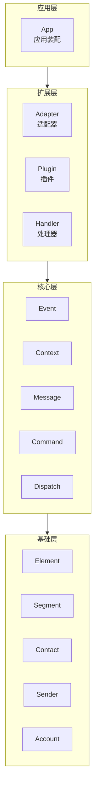

  

基于 Rust 的模块化机器人框架，围绕事件、适配器、插件和处理器构建

 

 

---

**[项目理念](#-项目理念) • [技术栈](#-技术栈) • [快速开始](#-快速开始) • [社区与链接](#-社区与链接) • [贡献指南](#-贡献指南) • [协议](#-协议)**

---

## 项目理念

puniyu 是一个模块化的 Rust 机器人框架，旨在提供灵活、高效的机器人开发体验。框架围绕以下核心概念构建：

- **适配器（Adapter）**：连接不同平台（如 QQ 等聊天平台）的桥梁
- **插件（Plugin）**：可插拔的功能模块，支持命令、任务、配置等扩展点
- **处理器（Handler）**：事件处理链路的核心，接收并处理各类事件
- **加载器（Loader）**：管理插件生命周期，提供统一的加载接口

框架采用 workspace 架构，将核心能力拆分到独立 crate，既保证职责清晰，又方便按需依赖。

## 技术栈

以下是 puniyu 框架使用的主要技术与依赖：

- **异步运行时**：[Tokio](https://tokio.rs/) — 生产级异步运行时
- **序列化**：[Serde](https://serde.rs/) + Serde JSON — 数据序列化与反序列化
- **Web 框架**：[Actix Web](https://actix.rs/) — HTTP 服务能力
- **宏能力**：[async-trait](https://docs.rs/async-trait)、[derive_more](https://docs.rs/derive_more)、[bon](https://docs.rs/bon) — 简化异步 trait、派生宏、builder 模式
- **命令解析**：自定义命令解析器 + 类型安全的命令类型系统
- **日志**：[log](https://docs.rs/log) + puniyu_logger — 统一日志抽象与实现
- **错误处理**：[thiserror](https://docs.rs/thiserror) — 友好的错误类型定义

## 快速开始

### 环境要求

- Rust `1.88.0` 或更高版本
- Cargo

> [!TIP]
> 详细的使用文档请参考各子 crate 的 README 或访问 [DeepWiki](https://deepwiki.com/puniyu/core)。

## 架构一览

## 社区与链接

- **GitHub**：<https://github.com/puniyu/core>
- **DeepWiki**：<https://deepwiki.com/puniyu/core>
- **crates.io**：<https://crates.io/crates/puniyu_core>
- **QQ 群**：[1022851882]("https://qun.qq.com/universal-share/share?ac=1&authKey=PKNBX8LArx1C8dmOpJG%2FVRPqivEZvCOwA9v9HNGC3TFxmtz1vjpT0OeoqsJzCZb3&busi_data=eyJncm91cENvZGUiOiIxMDIyODUxODgyIiwidG9rZW4iOiJxa3BNNTE0OFVsU25ETlFLVEx1NFBSWml2Ky9LaXhGd2VuYnphcmluaVZyRmJXa0lVdlIwSnFCeStxZXZvb3BWIiwidWluIjoiMzM2OTkwNjA3NyJ9&data=bPNY-UGLKcaZlWoL4qBAAM7OcMu4G3vifNNpLxB6luRVuFGcMjNqIcop4iU0Tn3igaekTbvQPUCuNPjo_F1P9g&svctype=4&tempid=h5_group_info")

## 贡献指南

欢迎贡献 puniyu 项目！我们非常感谢开源开发者的参与。

- 提交 PR 前请先查看现有代码风格
- 遵循 workspace 的 Rust 版本要求（`1.88.0`+）
- 确保 `cargo fmt` 和 `cargo clippy` 通过
- 详细贡献规范请参考各子 crate 的 README

## 协议

puniyu 采用 [LGPL-3.0](LICENSE) 开源协议。